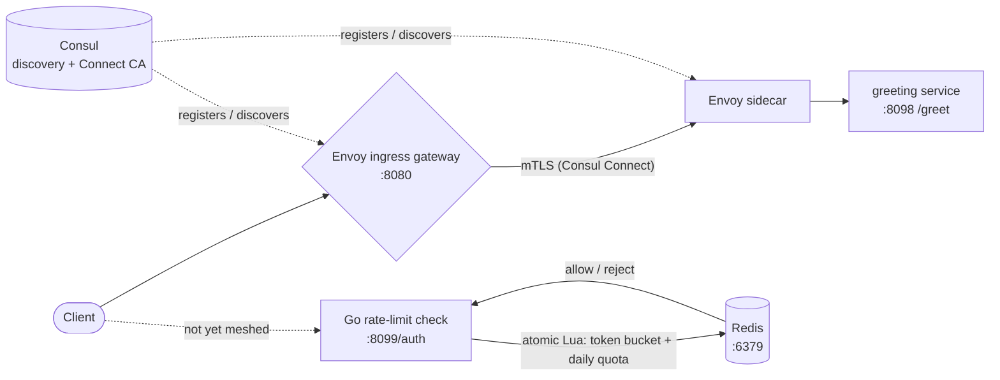

# API Gateway: Consul Connect + Envoy mesh

A distributed system built in **Go**, fronted by a **Consul Connect / Envoy**
service mesh. It started from the [`rate-limiter.md`](../rate-limiter.md)
design (two limits per client, checked at the edge, fail-open) and is
evolving into a production-oriented, multi-service gateway: services are
independently deployable, routing is driven by **service discovery** (Consul),
and transport between mesh members is **mTLS** (Consul Connect, Envoy sidecars)
rather than plaintext.

## Architecture



Two independent binaries today:

| Binary       | Port    | Purpose |
|--------------|---------|---------|
| `gateway`    | `:8099` | `POST` `/auth`: `checkLimit(api_key) -> allow \| reject`. Plain HTTP for now — not yet part of the mesh (an `ext_authz` Envoy filter calling this service is a later phase). |
| `greeting`   | `:8098` | Example standalone backend, reachable through the mesh only (`greeting-sidecar`'s Envoy proxy terminates mTLS on its behalf). |

The Envoy **ingress gateway** (Consul Connect) is the client-facing edge,
replacing Traefik: it routes `:8080` traffic to `greeting` over the mesh per
`deploy/consul/ingress-gateway.hcl`. `gateway` (the rate-limit check) is
reachable directly on `:8099` in this phase, outside the mesh.

## How it implements the design

- **Two limits, both must pass.** A per-second **token bucket** (refills
  continuously, so no fixed-window boundary burst) and a **daily quota**
  (fixed-window `INCR` with a 24h TTL).
- **Shared, atomic state.** The whole check is one Redis **Lua script**
  (`Eval`), so concurrent gateway instances cannot double-count a client — no
  distributed lock serializing the hot path.
- **Tiered limits.** `free` (100 req/s, 1M/day) vs `paid` (1k req/s, 10M/day),
  selected by API key. See `internal/ratelimit/limit.go`.
- **IP-based fallback.** Clients without an API key are keyed by `X-Forwarded-For`
  and limited at the free tier (abuse prevention).
- **Fail-open.** If Redis is unreachable the request is allowed through
  (over-admission during an outage beats blocking all traffic). Configurable via
  `FAIL_OPEN`.

## Layout

```
cmd/gateway/            entrypoint: rate-limit check service (plain HTTP, not yet meshed)
cmd/greeting/           entrypoint: standalone greeting service (Consul Connect-enabled)
internal/config/        env-driven configuration
internal/ratelimit/     the rate limiter module
  limit.go              tiers + limits + Decision
  store.go              Store interface (atomic Check over both limits)
  lua.go                the atomic Redis Lua check
  redis.go              RedisStore (primary)
  memory.go             MemoryStore (local dev / tests)
  limiter.go            fail-open / fail-closed policy
internal/api/           check-service HTTP surface
  auth.go               rate-limit handler (allow 200 / reject 429)
  server.go             wires the check listener
internal/httpserver/    shared HTTP server plumbing (both binaries)
internal/discovery/     Consul (+ Connect) self-registration
internal/module/        vertical service modules
  greeting/             example backend, served by cmd/greeting
deploy/                 Docker + Consul + Redis
  docker-compose.yml
  consul/ingress-gateway.hcl   ingress listener -> service routing
```

## Running

### Quick start (full stack: Consul mesh + Redis + gateway + greeting)

```bash
make compose-up
```

Then hit `greeting` through the mesh (Envoy ingress gateway :8080). The
ingress gateway routes by virtual host, so the request needs a `Host` header
matching Consul's generated domain (`<service>.ingress.*`):

```bash
curl -H "Host: greeting.ingress.dc1.consul" "http://localhost:8080/greet?name=world"
```

This dev-mode Consul (no ACLs) allows mesh traffic by default. To see
enforcement in action, deny it explicitly and watch the request start
failing (403), then delete the intention to restore the default-allow:

```bash
docker compose -f deploy/docker-compose.yml exec consul consul intention create -deny ingress-gateway greeting
docker compose -f deploy/docker-compose.yml exec consul consul intention delete ingress-gateway greeting
```

And the rate-limit check directly (not yet meshed):

```bash
curl -s -o /dev/null -w "%{http_code}\n" -H "X-API-Key: anon-key" -X POST http://localhost:8099/auth
```

- Consul UI: <http://localhost:8500/ui/>
- Gateway health: <http://localhost:8099/healthz>

`make compose-down` stops the stack.

### Local dev (no Docker, no Consul)

```bash
make run            # rate-limit check service, in-memory only if REDIS_ADDR unset/unreachable
make run-greeting   # greeting service
curl -s -o /dev/null -w "%{http_code}\n" http://localhost:8098/greet
```

## Configuration (env vars)

| Variable          | Default           | Description                                        |
|-------------------|-------------------|-----------------------------------------------------|
| `GREETING_ADDR`   | `:8098`           | greeting service bind address                       |
| `CHECK_ADDR`      | `:8099`           | Rate-limit check bind address                        |
| `REDIS_ADDR`      | `localhost:6379`  | Shared Redis                                          |
| `FAIL_OPEN`       | `true`            | Allow traffic when Redis is unavailable               |
| `CHECK_TIMEOUT`   | `50ms`            | Per-check budget to protect the <5ms p99 goal        |
| `CONSUL_ENABLED`  | `false`           | Self-register with Consul                              |
| `CONSUL_CONNECT`  | `false`           | Also register a managed Envoy sidecar (mTLS mesh)     |
| `CONSUL_ADDR`     | `127.0.0.1:8500`  | Consul agent HTTP API address                          |
| `SERVICE_NAME`    | *(per binary)*    | Consul service name to register under                 |
| `ADVERTISE_ADDR`  | *(unset)*         | Address other mesh members use to reach this instance |

## Verify

```bash
make test   # unit tests: burst, refill, quota, fail-open, tiering, IP fallback
make vet
make lint   # golangci-lint, if installed
```

## Trade-offs (mirroring the design doc)

- **Single point of failure**: Redis. Mitigated by fail-open and (in production)
  primary + replica.
- **Approximate accuracy**: fail-open can briefly over-admit; acceptable for a
  best-effort protection mechanism.
- **Hot key**: a single noisy client's counter is one Redis key. If this bites,
  shard the counter into N sub-counters summed at check time (not implemented).